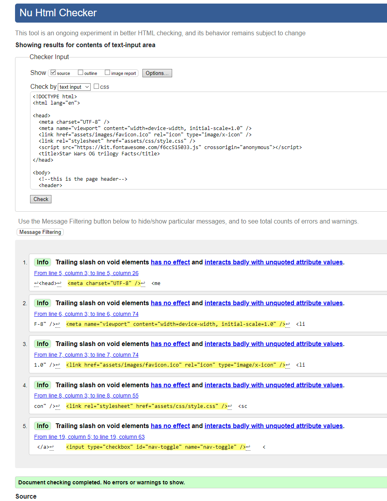

# Star Wars VFX website 
The Star Wars website is a fan page detailing the VFX and sound effects used to create the stars wars original trilogy. You will be able to use this website to view images of the set artists, the  techniques they used to bring the movies to life, and video footage of behind the scenes of the making of the Star Wars movies.

 You can find contact information at the bottom of the homepage. You can use the sign in page to subscribe for monthly newsletters.
This site is targeted at all star wars fans and at those interested in the visual and sound techniques for film.

# Features

- **Navigation Bar**
  
  - Featured on all 3 webpages is a fully responsive navigation bar that has links to the logo, Home page, Gallery and Sign in page. The navigation bar look identical on all pages so it doesn't course any confusion and allows for easier navigation.
  
  - The purpose of this section is to allow users to easily navigate across the pages without having to use the back button to return to certain pages.
  
  - On mobile phones the navigateion bar is turned into a drop down menu to allow for an easier viewing experience on the website and to keep everything looking neat and tidy.

  

- **Home Page Image**
    
    - The image on the home page includes 2 text overlays one gives a run down on what to expect when viewing the website and the second one is an about us section breifly explaining who i am and why i created the website in the first place.
    
    - This section is here to introduce you to the website and let the user know a little more about the person who made it. 

- **Why we Created the Wbsite section**
    
    - The why we created section is here to explain why the website was created and the perpose behind it.

    - The user will see that this website was created by a dedicated Star Wars fan and by someone who is facinated with how it was all created.

    

- **Contact Us**
    
    - I added the contact us section as a way for users to reach out to me and let me know if i can improve anything or if theres any information i have missed or they would like adding.

    

- **The Footer**

    - The footer includes links to all the relevant social media sites for this website, clicking on the images will open up the social media page in a new tab to allow for easier user naviagtion.

    - The footer is valuable to the site as it encourages the users to check out the social media pages for updates to the website or to comment ideas for the website.

    - The footer is viewable on all pages of the website.

    

- **Gallery**
    - In the gallery at the top of the page is a back ground image with some text overlayed onto it, the text is there to give a breif explination as to what you'll find in the gallery and giving credit to a youtuber who made a very hand video i used at the bottom of the page.

    - Below the top image is the image gallery itself with each image having text overlayed one another giving a breif explination of each image.

    - Below the image gallery is the youtube video mentioned at the top of the page which was made by StudioBinder and goes into alot of detail about techniques used to make the VFX and sound FX used in the movies.

    
    
    
    

- **Sign In**
  
  -This page will allow the user to sign in or create an account for the website to recive newsletter comment/contact me easier and let them connect with other members of the website.

  

### Features left to implement

- need to add the register for account page as the link currently doesn't take you anywhere and would like to add some animations in the future.

# Testing

Testing i have done for the website are html validator for all html forms and css validator for all css forms, the validators did come back with some issues they had wit hteh code but i have since fixed these and now everything has come back with the green light and works as intended.

The website also works on different screen sizes (phones, tablets, laptops and computers) with changes on all of them to accomidate for teh differance in size and to be able to show all information clearly to the user.

Some bugs i encountered where not having the video on the gallery page have the correct styling for the width and height so that was fix and all seems to work well now, another bug i found was while creating the sign in page the page itself didn't fit to screen with mobiles, tablets, etc and would only work on desktops my fix for this was to completely rewrite all the css code and change how some of it was wrriten and all seemed to wokr from then on. 

### Validator Testing

### Unfixed Bugs
the only unfixed i can think of is the sizing of everything for larger laptops screen sizes the responsiveness works well on every other screen size apart from larger laptop sizes.

## Deployment

- The site was deployed to GitHub pages. the steps to do so are as follows
  - In the GitHub repository make your way to the settings tab
  - on the side you'll see a list of options, find the option that says pages
  - when in there find the drop down box and select the master branch options
  - once the master branch option is selected the page will be automatically refreshed once done in the branch option make sure the options main, /root then hit save.

The link to my deployed website can be found here. [Link to Deployed Site](https://narzmarz.github.io/project-1/)

## Credits

### Content
All writing on my page is my own how ever the images are all from google images that where either free to use or someone reuploaded old photos from the sets of the movies.
The video at the bottom of the page is a youtube video made by the channel StudioBinder explaining how all the sound FX and VFX where made in those movies in great detail. 